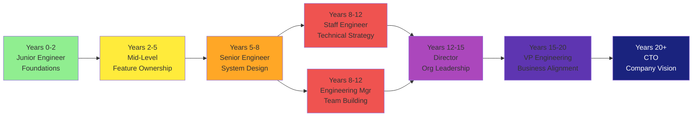

# Getting Started: Planning Your Career Path

> Start here if you're a computer science graduate or early-career engineer wondering how to reach CTO level.

---

## 🚀 Quick Start: Running This Guide Locally

Want to read this offline or contribute? Here's how to get it running:

```bash
# Clone or navigate to the project directory
cd cto-career-journey

# Activate virtual environment
source .venv/bin/activate  # macOS/Linux
# or
.venv\Scripts\activate     # Windows

# Start the development server
mkdocs serve

# If port 8000 is busy:
mkdocs serve --dev-addr 127.0.0.1:8001
```

Then visit:
- **http://127.0.0.1:8000** (default)
- **http://127.0.0.1:8001** (alternate port)

Files auto-reload on save. Happy reading!

---

## 🎯 Key Questions This Guide Answers

- What is the realistic timeline from Junior Engineer to CTO? (10–20 years)
- What happens at each promotion level? What skills do I need?
- Should I choose the **IC (Individual Contributor) track** or **Management track**? (Or both?)
- What do **Tech Leads** actually do?
- How do I **interview well** for promotions?
- What books should **I read** at each stage?
- How do **companies differ** in hierarchy? (Startup vs. FAANG vs. Scale-up)

---

## 📋 Prerequisites

By reading this guide, you should have:

- [ ] Completed a **CS degree or bootcamp** (or equivalent self-study)
- [ ] Written and shipped code in at least **one language**
- [ ] Worked with **Git, testing, and basic DevOps**
- [ ] Realistic expectations — this is a **10–20 year journey**, not 2–3 years
- [ ] Interest in **learning beyond code** — systems design, people, business, strategy

---

## 🗺️ Recommended Reading Path

### For Junior Engineers (0–2 years)
1. Start with: [Engineer Levels Overview](fundamentals/01-engineer-levels.md)
2. Deep dive: [Junior Engineer](fundamentals/02-junior-engineer.md)
3. Jump to: [Essential Books — Foundation](reference/01-essential-books.md#foundation-years-0-5)
4. Bookmark: [Interview Prep](reference/03-interview-prep.md) for mid-level prep

### For Mid-Level Engineers (2–5 years)
1. Review: [Mid-Level Engineer](fundamentals/03-mid-level-engineer.md)
2. Plan ahead: [IC vs Manager Track](intermediate/01-ic-vs-manager-track.md)
3. Read: [Essential Books — Growth](reference/01-essential-books.md#growth-years-5-10)
4. Prepare: [Interview Prep](reference/03-interview-prep.md) for Senior role

### For Senior Engineers (5–8 years)
1. Deep dive: [Senior Engineer](fundamentals/04-senior-engineer.md)
2. Choose your path: [Staff Engineer](intermediate/02-staff-engineer.md) or [Manager Path](intermediate/03-engineering-manager.md)
3. Books: [Essential Books — Leadership](reference/01-essential-books.md#leadership-years-8-15)
4. Prep: [Interview Prep — Staff/Manager level](reference/03-interview-prep.md#staffmanager-level)

### For Staff/Director/VP Aspiring Engineers
1. [Staff Engineer Path](intermediate/02-staff-engineer.md) or [Engineering Manager](intermediate/03-engineering-manager.md)
2. [Director of Engineering](advanced/01-director-of-engineering.md)
3. [VP Engineering](advanced/02-vp-engineering.md)
4. [CTO Role](advanced/03-cto-role.md)
5. Read everything in [Essential Books — Executive](reference/01-essential-books.md#executive-years-15)

---

## 🚦 How to Know When You're Ready for the Next Level

Each level has **clear signals**:

| Level | You Know It's Time When |
|---|---|
| **Mid-Level** | You can own a feature from design → shipping without constant supervision |
| **Senior** | You influence cross-team decisions; mentoring happens naturally |
| **Staff Engineer** | You set technical direction for the org; you think in 6–12 month arcs |
| **Manager** | Your mentoring expands to formal hiring, firing, and goal-setting |
| **Director** | You manage managers; org structure changes flow through you |
| **VP** | You own 30–200 person org; alignment with product/sales/finance matters |
| **CTO** | You set company tech strategy; board asks your opinion on direction |

---

## 💰 Compensation Reality

At each level, compensation *approximately* (varies by company size):

| Level | Base Range | Total Comp (w/ stock/bonus) |
|---|---|---|
| **Junior** | $80–130K | $100–150K |
| **Mid** | $120–180K | $150–250K |
| **Senior** | $160–250K | $220–400K |
| **Staff** | $200–350K | $300–600K+ |
| **Manager** | $180–280K | $250–450K |
| **Director** | $250–400K | $350–700K+ |
| **VP** | $300–600K | $500–1M+ |
| **CTO** | $400–1M+ | $800–3M+ |

*Note: These are U.S. FAANG-adjacent companies circa 2026. Varies wildly by location, company stage, and market.*

---

## 🧭 Your 30-Year Career Arc (Typical Path)



---

## 📚 30-Year Learning Plan

| Period | Focus Books | Technical Focus | Business Skills |
|---|---|---|---|
| **Yrs 0-5** | Code Complete, DDIA, System Design | Algorithms, Design Patterns, APIs | Communication, Code Review |
| **Yrs 5-10** | Designing Data-Intensive Applications, Staff Engineer | Distributed Systems, Scaling | Mentoring, Org Politics |
| **Yrs 10-15** | High Growth Handbook, Radical Candor, Good Strategy Bad Strategy | Architecture, Technical Vision | People Management, Strategy |
| **Yrs 15+** | CEO, Billion-Dollar Lessons, The Effective Executive | Long-term Technology Bets | Board Relations, Market Vision |

---

## ❓ FAQ

**Q: Can I become CTO without managing people?**  
A: Yes. Staff Engineer → Principal Engineer → Chief Architect is a valid path. It requires deep technical expertise + strategic influence.

**Q: What if my company is small / a startup?**  
A: Smaller companies compress the timeline. You might hit "Senior Engineer" impact in 2–3 years. But the skills required are the same; the terminology is just different.

**Q: Should I job-hop to move faster?**  
A: Strategic job changes (3–5 year cycles) accelerate growth. Staying at one company: deeper knowledge but slower progression. 2–3 moves in your first 15 years is normal.

**Q: How long does each level really take?**  
A: Minimums: Junior (2 yrs) → Mid (3 yrs) → Senior (3 yrs) → Staff/Manager (4–5 yrs) → Director (3–4 yrs) → VP (3–5 yrs) → CTO (2–5 yrs).  
*Total: 10–20 years. Plan accordingly.*

**Q: What if I want to switch between IC and management?**  
A: Totally normal. You can go Senior IC → Manager → Director → VP, or Manager → Senior Engineer (harder, but possible). Your IC skills make you a better manager.

---

## 🎯 Next Steps

1. **Find your current level** → [Engineer Levels Overview](fundamentals/01-engineer-levels.md)
2. **Plan your next 5 years** → Choose [IC Path](intermediate/02-staff-engineer.md) or [Management Path](intermediate/03-engineering-manager.md)
3. **Start reading** → [Essential Books](reference/01-essential-books.md)
4. **Prepare for your next interview** → [Interview Prep Guide](reference/03-interview-prep.md)

---

*You got this. It's a long journey, but every stage is achievable with the right plan and books.*

--8<-- "_abbreviations.md"
