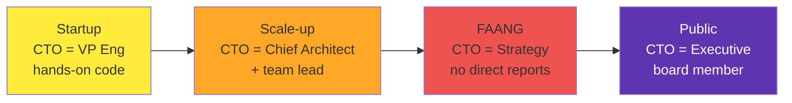

# CTO: Chief Technology Officer (Years 15+) — Your Goal

> Set company technology vision. Member of executive team. Leader of leaders.

---

## What "CTO" Actually Means

CTO definitions vary wildly by company.

### At a Startup (50–200 people)
- **VP Engineering + technology visionary**
- Manages engineering team (20–50 people)
- Sets technical roadmap
- Reports to CEO
- Often co-founder

### At a Scale-up (200–1000 people)
- **Chief architect + org leader**
- May manage VP Engineering and Dir Infrastructure
- Sets long-term tech strategy
- Reports to CEO
- Sits in board meetings

### At a FAANG (1000+ people)
- **Pure technical/architecture role**
- Doesn't manage engineering (VP does)
- Sets company-wide technical strategy
- Advises on major bets
- Reports to either VP Eng or CEO (varies)

### At a Public Company
- **Executive officer**
- Responsible for technology roadmap
- May manage multiple VPs
- Board member often
- Deep involvement in investor meetings

---

## What Unites All CTOs

**Regardless of company size:**

✅ **Sets technology vision** — where should company technology go?  
✅ **Makes strategic bets** — what technologies matter in 5 years?  
✅ **Represents engineering** — advocates for technical excellence to board  
✅ **Leads through influence** — people follow because they respect the vision  
✅ **Understands business deeply** — ROI, customer needs, competitive advantage  
✅ **Thinks 10+ years ahead** — not quarterly, not yearly  

---

## Two Common CTO Paths

### Path 1: Management → VP → CTO
- Build great teams
- Show business acumen
- Get promoted to VP
- CTO as next step or VP already is CTO

**Typical timeline**: 5 yrs Manager + 5 yrs Director + 5 yrs VP = 15 years

### Path 2: IC → Staff → Principal → CTO
- Develop deep technical expertise
- Show strategic thinking
- Gain business understanding
- Transition to CTO role

**Typical timeline**: 8 yrs Senior/Staff + 4 yrs Principal + business acumen = 12+ years

**Both are valid.** Path 1 is more common. Path 2 is rarer but emerging.

---

## Your CTO Responsibilities

### Technology Strategy
- 10-year vision for company technology
- Major technology bets (languages, frameworks, infrastructure)
- Competitive advantage through technology
- Technology roadmap alignment with business

### Organization
- Ensure engineering org has capability to execute strategy
- Hire and develop VPs / Sr leadership
- Set culture and values
- Manage engineering budget ($10M–$100M+)

### Business Leadership
- Board member (often)
- Executive team alignment
- Investor updates on technology
- Customer discussions on technical capabilities

### Decision-Making
- Should we build or buy?
- Make/buy/partner decisions
- Major technology bets
- Organizational structure

---

## The CTO Role by Company Stage

---

## What It Takes to Become CTO

### Technical Foundation
- 8–15 years of technical experience
- Deep expertise in 1–2 domains
- Can still talk credibly about architecture
- Read code occasionally

### Business Acumen
- Understand revenue models
- Know your market and competitors
- Grasp financial implications of technical decisions
- Think about customer value, not just elegance

### Leadership
- Built and scaled teams (or company)
- Made hard decisions under pressure
- Handled conflict and politics
- Developed leaders below you

### Vision
- Thought about technology 5–10 years out
- Made bets that turned out right
- Communicated vision that inspired people
- Stayed curious about emerging tech

---

## Compensation at CTO

Varies widely by company stage:

| Company Stage | Base | Bonus | Stock | Total |
|---|---|---|---|---|
| **Startup (Series B)** | $150–250K | 10–20% | 0.5–2% equity | $200K–500K+ |
| **Scale-up (Series C+)** | $250–400K | 20–40% | $200–500K/yr | $500K–1M+ |
| **FAANG** | $300–600K | 30–50% | $500–1M/yr | $800–2M+ |
| **Public Company** | $400–1M | 50–100%+ | varying | $1M–$10M+ |

Plus: Options, acquisition payouts, board seats (outside companies), etc.

---

## CTO Success Metrics

- ✅ Your technical strategy is executed and delivers results
- ✅ Engineering org operates smoothly (low turnover, good morale)
- ✅ Company ships on time, customers are happy
- ✅ You've placed 2–3 people into VPs/Directors below you
- ✅ Board respects your vision and input
- ✅ Competitors notice your technology advantages

---

## The Next Chapter After CTO

- **Stay at company** (IPO, growth, stability)
- **CEO** (less common, but some CTOs become CEO)
- **Venture** / Board seats (leverage expertise)
- **Startup again** (more autonomy)
- **Professor** / Advisory (share knowledge)

---

??? question "How long does it take to become CTO from Junior Engineer?"
    Typically 15–25 years. Fast track: 12–15. Slow track: 20–30. Depends on company changes and growth.

??? question "Is it better to be CTO at a startup or FAANG?"
    Different experiences. Startup = more impact on everything but less resources. FAANG = more resources but less direct impact. Choose based on what energizes you.

??? question "Can I become CTO without a CS degree?"
    Yes. Many CTOs come from bootcamps or non-traditional paths. What matters: demonstrated technical wisdom + leadership.

---

*You've made it. Now: [Board-Level Thinking](04-board-level-thinking.md). And read everything in Reference.*

--8<-- "_abbreviations.md"
