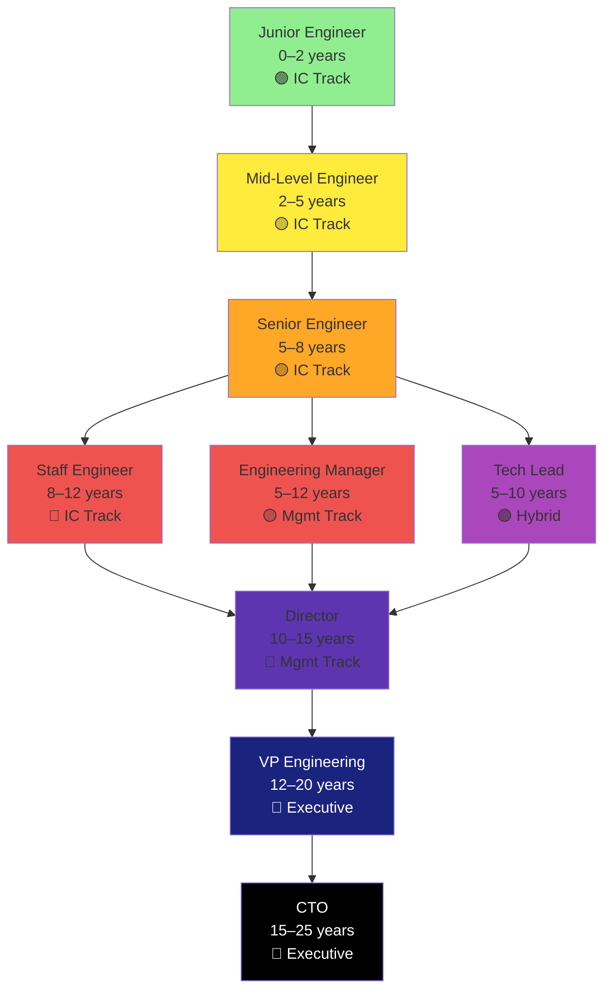

# Engineer Levels Overview

> Understand what each engineering level means in real companies.

---

## The 8 Levels (Typical Tech Company)

---

## Quick Reference Table

| Level | Years | Role | Reports | Annual Comp | Key Metric |
|---|---|---|---|---|---|
| **Junior Engineer** | 0–2 | Learning, shipping code | 0 | $100–150K | Velocity + Code Quality |
| **Mid-Level Engineer** | 2–5 | Owning features, mentoring | 0 | $150–250K | Impact + Mentoring |
| **Senior Engineer** | 5–8 | System design, cross-team | 0–1 | $220–400K | Scope + Influence |
| **Staff Engineer** | 8–12 | Org-wide technical strategy | 0 | $300–600K+ | Technical Direction |
| **Engineering Manager** | 5–12 | Team building, people dev | 5–12 | $250–450K | Team Health + Delivery |
| **Tech Lead** | 5–10 | Technical + people leadership | 3–5 | $220–350K | Team + Technical Impact |
| **Director** | 10–15 | Multi-team strategy | 2–3 managers | $350–700K+ | Org Impact + Goals |
| **VP Engineering** | 12–20 | Org strategy, exec alignment | Directors | $500–1M+ | Org Health + Alignment |
| **CTO** | 15–25 | Technology vision, board | VPs | $800–3M+ | Company Tech Strategy |

---

## Why Levels Matter

### For You
- Understand expectations at your current level
- Know what skills to develop for next level
- Benchmark compensation
- Plan your 5-year growth

### For Your Manager
- Clarity on what "Senior" means
- Framework for promotions
- Fair, consistent evaluation

### For Your Company
- Predictable career progression
- Reduced confusion about roles
- Clearer hiring targets

---

## Two Valid Growth Paths

### **Individual Contributor (IC) Track**
- **Stays hands-on** — writing code, designing systems
- **Broader influence** — affects org through expertise, not hierarchy
- **Examples**: Staff Engineer → Principal Engineer → CTO (if deep enough)
- **Pros**: Keep coding, set technical direction, often higher compensation
- **Cons**: Harder to influence non-technical decisions, less "prestige" in some orgs

### **Management Track**
- **Leads people** — hiring, mentoring, performance management
- **Business influence** — understands revenue, customers, strategy
- **Examples**: Manager → Director → VP → CTO
- **Pros**: Broader organizational impact, traditional leadership path
- **Cons**: Less coding, more meetings, requires people skills

### **Hybrid Track (Tech Lead)**
- **Combination** — technical authority + light people management
- **Sweet spot** — some IC work, some mentoring
- **Duration**: Usually 3–5 years before choosing IC or Management
- **Pros**: Best of both, test management fit
- **Cons**: Ambiguous, easy to burn out, hard to evaluate

---

## The Decision Point (Years 5–8)

At **Senior Engineer**, you choose:

| Decision | Path | Impact |
|---|---|---|
| **"I love coding and system design"** | IC Track → Staff Engineer | Deep technical authority |
| **"I love growing people"** | Management → Engineering Manager | Build teams |
| **"I want both for now"** | Tech Lead | Make decision in 3–5 years |

This choice **is not permanent**. You can:
- Manager → Senior Engineer (harder, but possible)
- Staff Engineer → Manager (takes adjustment)
- Tech Lead → either (that's the point)

---

## Myths Debunked

???+ myth "Myth: Management is the only path to CTO"
    False. You can become CTO as a Principal Engineer if you combine deep technical expertise with business understanding.

???+ myth "Myth: You should reach Senior Engineer in 3 years"
    False. It typically takes 5–8 years. Rushing = missing foundations.

???+ myth "Myth: Promotions happen automatically."
    False. You need to **demonstrate** the next level's impact for 6–12 months before promotion.

???+ myth "Myth: More levels = always better."
    False. Staff Engineer at a 200-person company might have more impact than Director at a 5,000-person company.

???+ myth "Myth: You can't move between IC and management after 5 years."
    False. It's uncommon but totally doable if you have the skills.

---

## Key Insight: Impact Over Title

Two engineers with same title can have VERY different impact:
- **Junior at startup** might own entire system
- **Senior at FAANG** might own one service

The levels in this guide define **expected impact**, not title. Your job is to understand what you're actually doing.

---

??? question "What if my company doesn't follow this structure?"
    Most companies deviate. Use the skills and impact descriptions, not titles. Ask your manager: "What does the next level look like here?"

??? question "Can I skip a level?"
    Very rarely. Most companies expect progression through levels. Skipping rare = company recognizes exceptional growth.

??? question "What if I plateau?"
    Normal. You might be at your optimal level. Talk to your manager about deepening expertise within your level.

---

*Next: Choose your path. Start with [Junior Engineer](02-junior-engineer.md) if you're new.*

--8<-- "_abbreviations.md"
