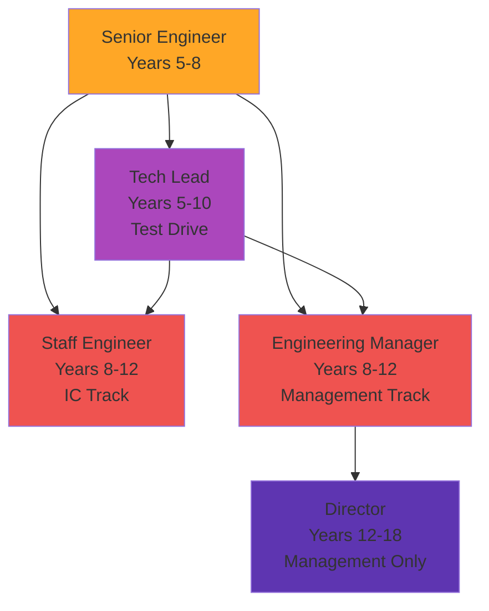

# Senior Engineer (Years 5–8) — Deep Dive

> Years 5–8: System architect. Cross-team influencer. The decision point.

---

## What "Senior Engineer" Actually Means

A Senior Engineer:

- **Designs systems** (not just features) that scale and are maintainable
- **Influences across teams** — your opinion shapes decisions
- **Owns technical strategy** for their area
- **Makes trade-off calls** — balancing speed, quality, cost, risk
- **Mentors multiple people** (usually juniors, sometimes peers)
- **Understands the business** — knows revenue implications of technical decisions
- **Operates somewhat independently** — doesn't need to check every decision

**Scope**: Entire service or architectural domain (multiple teams may depend on you).

---

## Your Years 5–8: The Critical Phase

### What Changes from Mid-Level?

**Feature ownership → System ownership**

- Instead of: "Build feature X"
- Now: "Own service Y's health, scalability, and evolution"

**Personal impact → Leverage through others**

- Instead of: Your code
- Now: Your decisions affect what 10 other engineers do

**Execution → Architecture**

- Instead of: "Ship it fast"
- Now: "Ship it right" (and maintain it for 5+ years)

**Coding 50% → Coding 30%, thinking 70%**

- More design documents
- More discussions
- More mentoring
- Less keyboard time

---

## Year-by-Year Breakdown (Years 5–8)

### Year 5-6: Becoming a Trusted Expert

**What you're doing:**
- Owning entire service or architecture area
- Leading design docs for major changes
- Mentoring 2–3 people formally
- Contributing to hiring for your team

**Skills:**
- **Architecture**: Scalable, maintainable systems for 5-year time horizons
- **Technical decision-making**: Know what matters and what doesn't
- **Communication**: Write documents people actually read
- **People leverage**: Your ideas executed by others
- **Judgment**: When to refactor vs. when to leave it alone

**Promotion signals (toward Senior → Staff or Manager):**
- "What service do you own? Why is it important?"
- "Tell about an architectural decision you made. What would have happened if you chose differently?"
- "Who have you mentored? How have they grown?"

---

### Year 6-8: System Thinker & Team Influencer

**What you're doing:**
- Owning architecture across multiple services
- Setting technical direction for crew/team
- Hiring and evaluating new engineers
- Representing your team in cross-functional decisions

**Skills:**
- **Cross-team coordination**: Align teams on APIs, infrastructure
- **Business acumen**: Connect technical decisions to revenue/cost
- **Risk assessment**: Know what could go wrong and plan for it
- **Strategic thinking**: 12–24 month technology roadmap
- **Culture**: How do you want your team to work?

**Signals for promotion to Staff/Manager:**
- "Walk me through your most complex system. Why is it designed that way?"
- "Tell me about a cross-team dependency you managed."
- "What's your vision for technical excellence in your area?"
- "How have you removed blockers for your team?"

---

## The Crucible: The IC vs. Manager Decision

**At Senior Engineer, you must choose your path for the next chapter.**

This is THE critical decision for your career.

### Individual Contributor Path (IC)
- **Master your domain deeply** — become the person everyone asks
- **Set technical strategy** — your ideas shape what engineers build
- **Stay hands-on** — write code and design systems
- **Influence without authority** — people follow your lead because you're right
- **Comp**: Often higher than Manager at same org size
- **Pros**: Keep coding, deep impact, often more autonomy
- **Cons**: Limited influence on business/people decisions, "staff engineer" perception varies by company

### Management Path
- **Build and lead teams** — your impact is through people
- **Hire, develop, retain** — grow people who grow the company
- **Set team goals** — align with business, measure results
- **Influence through authority** — people listen because you're their manager
- **Comp**: Similar or slightly lower than IC at same level
- **Pros**: Broader organizational impact, build culture, path to VP
- **Cons**: Less coding, more politics, responsible for people's careers

### Hybrid (Tech Lead) — Try Before You Decide
- **Technical + light people management** — 70% IC, 30% manager
- **2–3 year experiment** — test the management waters
- **Decide later** — after trying it, choose IC or full management
- **Best for**: People unsure about their preference
- **Risk**: Can be ambiguous, hard to excel at both

---

## 3 Critical Skills at Senior

### 1. **Technical Judgment**
You can:
- Design systems that work 5 years later
- Know what's premature optimization and what's necessary
- Choose technologies and frameworks for the right reasons
- Estimate complexity accurately
- Make trade-off decisions (performance vs. code simplicity, speed vs. quality)

**How to improve**: Read DDIA thoroughly. Design things. Get feedback. Repeat in different domains.

### 2. **Mentoring at Scale**
You can:
- Mentor 2–4 people simultaneously
- Identify what each person needs to grow
- Give feedback that sticks
- Help people see blind spots
- Celebrate wins and learn from failures

**How to improve**: Take a mentoring course. Ask mentees for feedback. Reflect on what works.

### 3. **Communication**
You can:
- Write technical documents that inform decisions
- Explain complex systems to non-technical people
- Listen deeply (not planning your response)
- Disagree respectfully
- Change your mind when shown new evidence

**How to improve**: Write more. Get feedback. Listen to critiques. Repeat.

---

## The Senior Engineer Pitfalls

???+ warning "Pitfall 1: The Architecture Astronaut"
    You design perfect systems that no one understands or can maintain.  
    **Fix**: Design for your team's capability, not perfection.

???+ warning "Pitfall 2: Becoming the Bottleneck"
    Everything needs your approval before shipping.  
    **Fix**: Delegate. Train others. Trust them.

???+ warning "Pitfall 3: Analysis Paralysis"
    You analyze so much that decisions never ship.  
    **Fix**: Good now beats perfect later. Iterate.

???+ warning "Pitfall 4: Not Staying Hands-On"
    You design but never code, so designs are disconnected from reality.  
    **Fix**: Stay in the codebase. Write code. Feel the pain.

???+ warning "Pitfall 5: Burning Out on Mentoring"
    You mentor so much you can't do your actual job.  
    **Fix**: Boundary: X hours/week. Say no sometimes.

---

## What Promotion to Staff/Manager Looks Like

**Promotion criteria (what your manager assesses):**

✅ **Scope**: Are you handling projects only a Staff/Manager would handle?  
✅ **Independence**: Do you drive initiatives without supervision?  
✅ **Influence**: Do people listen to your technical or leadership decisions?  
✅ **Business acumen**: Do you understand revenue, customer impact, strategy?  
✅ **Teaching**: Have you grown multiple engineers?  
✅ **Initiative**: Do you spot org-level problems and propose solutions?  
✅ **Reliability**: Can the company depend on you for critical systems/teams?  

**Red flags:**
- ❌ You only work on what managers assign
- ❌ People don't trust your technical decisions
- ❌ You haven't mentored anyone meaningfully
- ❌ You don't understand why your work matters to the business

---

## Compensation at Senior Engineer

Typical FAANG-adjacent (2026):
- **Base**: $160–250K
- **Bonus**: 15–25%
- **Stock**: $100–200K/year
- **Total**: $220–400K

At startups: Lower base, higher equity.  
At FAANG: Upper end.  
At enterprise: Lower base, more stability.

---

## Books to Read at Senior Level

1. **[Designing Data-Intensive Applications](../reference/01-essential-books.md)** (mastery)
2. **[Staff Engineer: Leadership Without Management](../reference/01-essential-books.md)** — understand the Staff path
3. **[An Elegant Puzzle: Systems of Engineering Management](../reference/01-essential-books.md)** — understand management path before committing
4. **[The Goal: A Process of Ongoing Improvement](../reference/01-essential-books.md)** — systems thinking
5. **[Good Strategy Bad Strategy](../reference/01-essential-books.md)** — business thinking

---

## The Big Question: Keep Growing or Plateau?

At Senior Engineer, you have three choices:

1. **Keep advancing** → Staff/Manager track (demanding, rewarding)
2. **Deepen in place** → Become the world's best at your domain (comfortable, less growth)
3. **Shift domains** → Learn new area as Senior (rare, refreshing)

There's no shame in choice 2. Some of the best engineers stabilize here. But if you want CTO, you need to keep growing.

---

??? question "Is it too late to switch from IC to management at Senior?"
    No. It's uncommon but doable. You'll likely take a small step back in seniority (Senior IC → Manager, not Senior Manager immediately).

??? question "How do I know if I'm ready for Staff Engineer?"
    If your company asks, you're probably ready. If they don't ask, you might need to push for it or move companies.

??? question "Should I stay 8 years at one company?"
    Not necessarily. 5 years is solid. If you want to accelerate growth, 3-year moves to high-growth companies can be faster.

---

*Next: Navigate the decision. See [IC vs Manager Track](../intermediate/01-ic-vs-manager-track.md) or [Staff Engineer](../intermediate/02-staff-engineer.md).*

--8<-- "_abbreviations.md"
