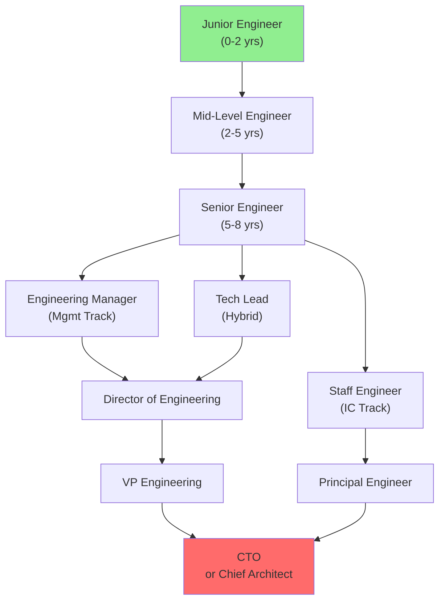

# Developer → CTO: The Complete Career Guide

> Your roadmap from first day as an engineer to leading technology at a company.

---

## 🎯 What You'll Learn

This guide maps the **entire career journey** from Junior Engineer to Chief Technology Officer, with clear expectations at each level:

| Level | Years | Role Focus | Level |
|---|---|---|---|
| **Junior Engineer** | 0–2 | Learning fundamentals, shipping code | 🟢 Beginner |
| **Mid-Level Engineer** | 2–5 | Owning features, mentoring juniors | 🟡 Intermediate |
| **Senior Engineer** | 5–8 | System design, cross-team impact | 🟡 Intermediate |
| **Staff Engineer** | 8–12 | Technical strategy, org influence (IC) | 🔴 Advanced |
| **Tech Lead** | 5–10 | Technical + people leadership (hybrid) | 🟡 Intermediate |
| **Engineering Manager** | 5–12 | Team building, hiring, people growth | 🟡 Intermediate |
| **Director** | 10–15 | Multi-team strategy, budget & goals | 🔴 Advanced |
| **VP Engineering** | 12–18 | Engineering org strategy, exec team | 🔴 Advanced |
| **CTO** | 15+ | Technology vision, board decisions | 🔴 Expert |

---

## 🗺️ Your Career Path Options

---

## 🚀 How to Use This Guide

1. **Check [Getting Started](GETTING_STARTED.md)** — understand where you are now
2. **Compare yourself to [Engineer Levels](fundamentals/01-engineer-levels.md)** — find your stage
3. **Explore your chosen path** — IC track, management track, or hybrid
4. **Review interview questions** for your target level
5. **Read the essential books** listed in the Reference section
6. **Return periodically** — your career is long-term, this evolves with you

---

## 💡 Key Principles of This Guide

### 1. **The Two Valid Paths Are Equally Valuable**
You can become CTO either as:
- **IC Path**: Deep technical expertise + strategic influence (Principal Engineer → CTO)
- **Management Path**: Building teams + business alignment (Manager → VP Engineering → CTO)

Both are legitimate. Choose based on what energizes you.

### 2. **Levels Are Defined by Impact, Not Title**
Your company's titles may differ, but the *expectations* are the same. A "Senior Engineer" at Google vs. a startup does similar things.

### 3. **Skill Compounding Matters**
- **Years 0–5**: Learn breadth (languages, frameworks, systems design)
- **Years 5–10**: Develop depth (become an expert in 1–2 domains)
- **Years 10–15**: Build business acumen (understand revenue, customers, markets)
- **Years 15+**: Leadership multiplier (your decisions affect hundreds of people)

### 4. **No Straight Line**
Real careers have:
- Lateral moves (Senior Engineer → Tech Lead, back to Senior)
- Company changes (skill growth + market changes)
- Specialization shifts (backend → data → infrastructure)
- Sabbaticals (learning, recovery, rethinking)

All are normal. Plan for multiple 5-year chapters, not one rigid path.

---

## 🎓 Why This Guide Exists

Most engineers don't know:
- What "Senior" actually means at a company
- How to prepare for Staff/Director/CTO interviews
- What books to read at each stage
- When to switch from IC to management (or vice versa)
- How long each transition really takes

This guide answers all of it, with **honest timelines, real interview questions, and books that shaped tech leaders**.

---

*Built for software engineers with computer science backgrounds who want to become CTOs. Hover over underlined terms to see definitions.*

--8<-- "_abbreviations.md"
